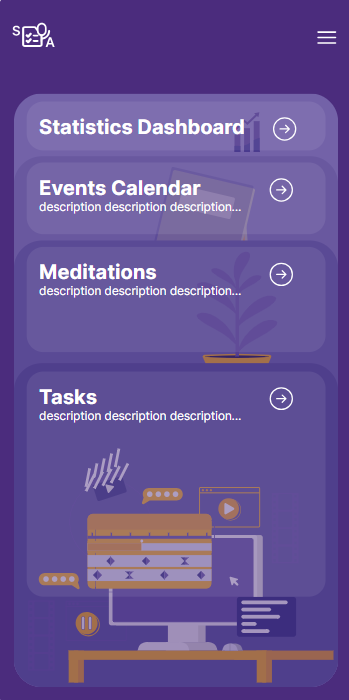
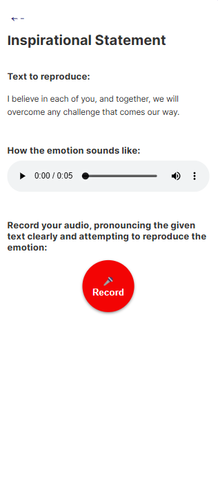
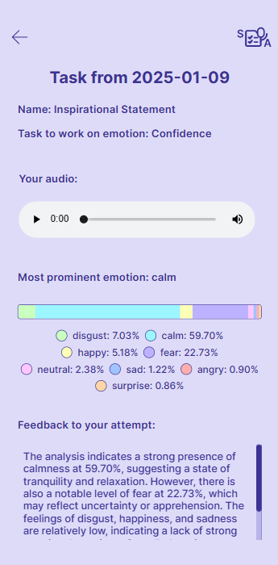
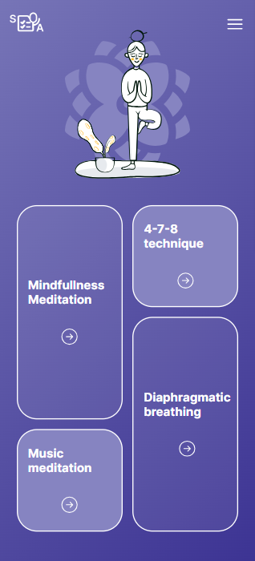
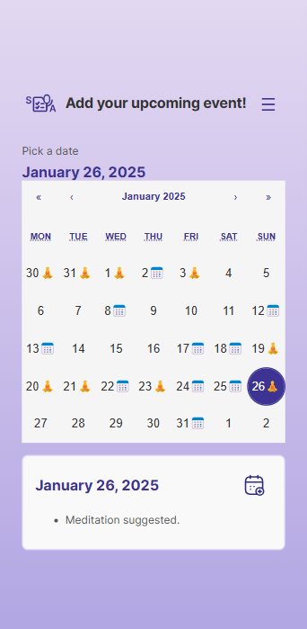

# 🧘 Speech Assistant 🧘‍♀️
### Project Overview
A web mobile first application designed to help users improve their
emotional expression, and manage performance anxiety for public speaking events. The
app offers interactive tools to practice various emotional tones, receive personalized
speech clarity feedback. By integrating a
calendar for tracking public speaking events, the app also provides pre-event meditation
and post-event stress management exercises, making it a holistic solution for users aiming
to improve their public speaking skills and manage presentation-related stress.
### Target Audience
* Students
* Professionals: Employees or managers who frequently present in meetings,
conferences, or public forums.
* Speakers and Performers
* Anyone with Social Anxiety: People looking for tools to become more comfortable
with public speaking and improve their overall communication skills.
### Core Features
* Tasks, which contain some text and emotion to reproduce.
User choose an audio recording with a specific emotional tone.
* User record the audio with pronouncing text, attempting to reproduce the given emotion.
* The system analyzes the emotional tone of the user's recording using natural language
processing and audio analysis technologies.
* The application provides feedback on how well the user’s voice matches the intended
emotion.

## Installation Guide

### Prerequisites

- Python 3.12

### Steps

1. **Clone the repository:**
   ```sh
   git clone https://github.com/borovykmary/SpeechAssistant
   ```

2. **Create A virtual environment:**
    ```sh
    python -m venv sa_venv
    source sa_venv/bin/activate  # On Windows: sa_venv\Scripts\activate
    ```

3. **Install the required packages:**
    ```sh
    pip install -r requirements.txt
    ```

4. **Install the ffmpeg on you machine:**
    ```sh
    https://phoenixnap.com/kb/ffmpeg-windows
    ```

4. **Add your api keys:**
    Create a .env file in the sa_backend directory and add your api keys:
    ```sh
    OPENAI_API_KEY=your_openai_api_key
    ```

5. **Run the application:**
    ```sh
    python manage.py runserver
    npm start
    ```
### Authors:
Maryna Borovyk, Oliwia Skrobacz, Illia Pastushok, Maja Ludwińska, Nikola Różycka
## Demonstration
### Main Screenshots:
If you want to see more screens check out our User manual located in /docs directory!
|  |  |
|:---------------------------------:|:------------------------------------:|
|  |  |
|  |  |

